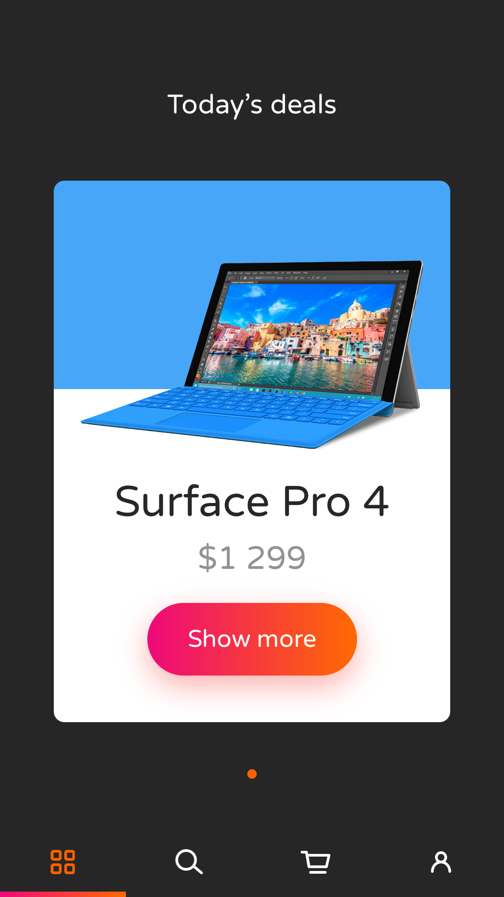
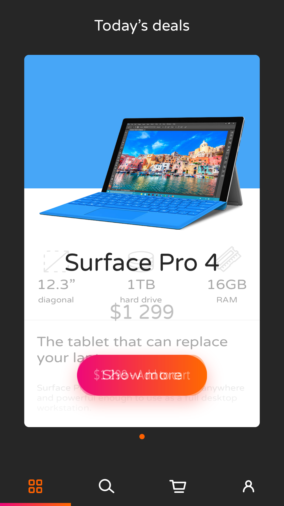
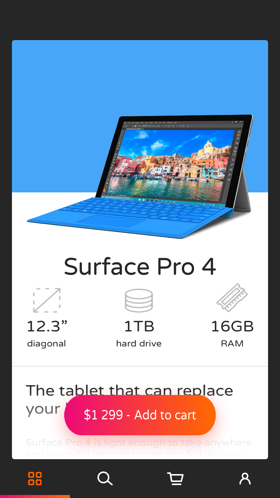
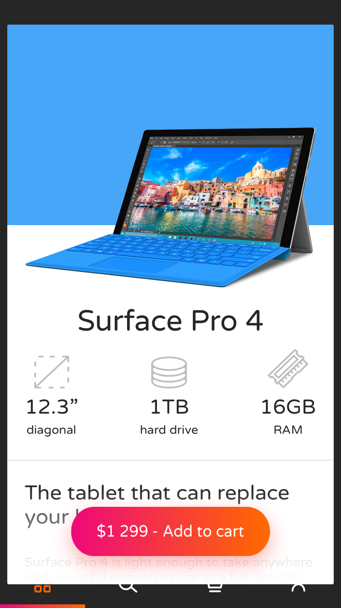
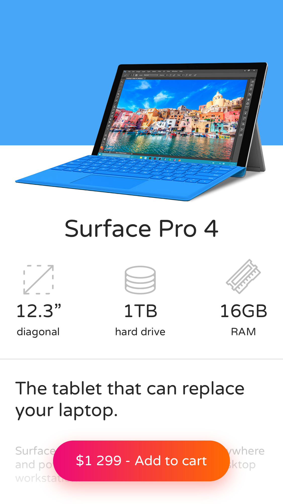
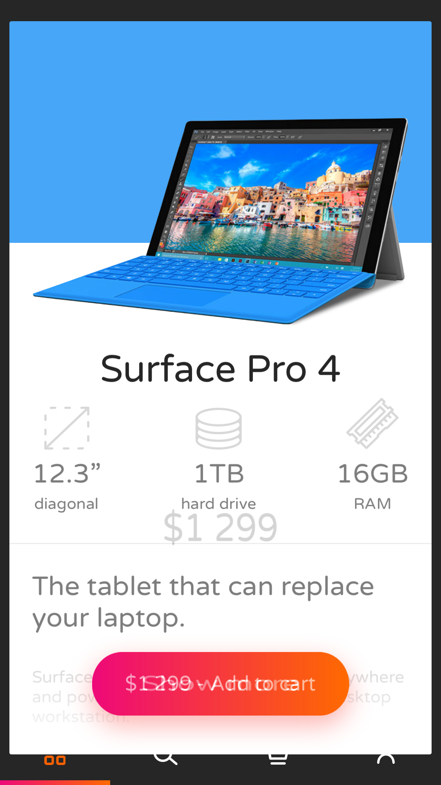

# E-commerce Today's deals interaction, iOS demo

> Based on [Dribbble shot by Matt Koziorowski](https://dribbble.com/shots/3116611-E-commerce-Today-s-deals-interaction) for [EL Passion](https://www.elpassion.com)

|Dribbble shot|Implementation|
|:-:|:-:|
|||

## Setup

Requirements: 

- Xcode 10.1
- [SwiftLint](https://github.com/realm/SwiftLint)
- [Carthage](https://github.com/Carthage/Carthage)

To set up the project, run `setup.sh` in Terminal.

## Run

Open `Demo.xcodeproj` and run `EcommerceDemo` scheme in a chosen simulator. If you want to run the demo on a real device, you need to update code signing configuration first.

## Implementation details

- Demo is covered by unit & snapshot tests, coverage is 100%
- There are no "production" dependencies, external frameworks are used to make testing easier
- Data are mocked up in [Product+Demo.swift](EcommerceDemo/Models/Product+Demo.swift) file
- Product card pagination is implemented in [DealsViewController](EcommerceDemo/Components/Deals/DealsViewController.swift) using [ScrollPageController](EcommerceDemo/Components/ScrollPage/ScrollPageController.swift)
- Product card images parallax effect is implemented in [ProductCardViewController](EcommerceDemo/Components/ProductCard/ProductCardViewController.swift)
- Product present/dismiss transition is implemented in [ProductPresenter](EcommerceDemo/Components/Product/ProductPresenter.swift) and  [ProductPresentTransition](EcommerceDemo/Components/Product/ProductPresentTransition.swift) using [SnapshotTransition](EcommerceDemo/Components/SnapshotTransition/SnapshotTransition.swift)
- Custom scroll behaviour on product screen (scrolling top background and floating title label) is implemented in [ProductView](EcommerceDemo/Components/Product/ProductView.swift)

### Present transition - test snapshots

|0%|20%|40%|60%|80%|100%|
|:-:|:-:|:-:|:-:|:-:|:-:|
|||||||

### Dismiss transition - test snapshots

|0%|20%|40%|60%|80%|100%|
|:-:|:-:|:-:|:-:|:-:|:-:|
|||||||

## License

Copyright © 2019 [EL Passion](https://www.elpassion.com)

License: **TBD**
